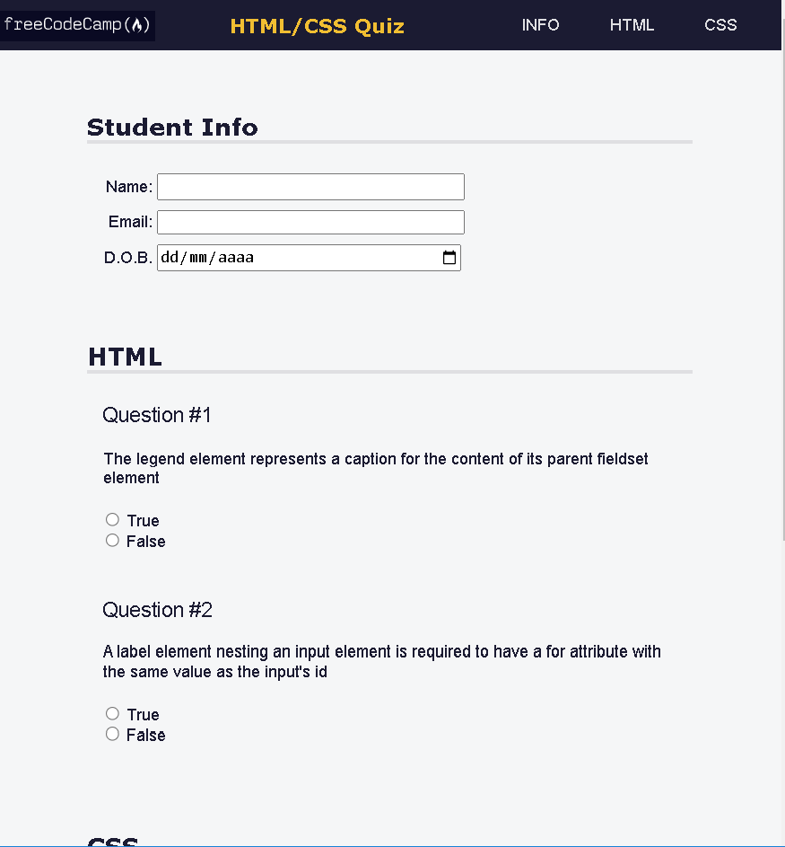

<<<<<<< HEAD
<h1>Accessibility Quiz</h1>

<h2>Quiz made on FreeCodeCamp to learn about accessibility and SEO</h2>

In this course I better understood these concepts:

    <ul>
        <li>`<meta name="description" content="page description">` it’s used for accessibility and SEO.</li>
        <li>SVG contains the attribute of `path`, which can allow you to resize the image without affecting resolution;></li>
        <li>`min()` property works similar to `width` and `max-width`. `min()` property works similar to width and max-width</li>
        <li>`>` selects a direct children of an element;</li>
        <li>`role` can be used to indicate purpose of an element on the page to assistive technologies;</li>
        <li>`aria-labelledby` can be used to reference another element to define it’s accessible name. The `aria-label` should be used if there’s no content that can be referenced to use a accessible name;</li>
        <li>accesskey it’s used to provide keyboard shortcuts.</li>
    </ul>

<h2>Preview</h2>
    

<h2>Conclusion</h2>
    
In this course I realized how important is semantic HTML, using suitable tags in your code can contribute a lot for accessibility on your web page, attributes like `aria-labelledby` and `role` are some of them.

    
My current goal is to master React, but first I need to complete some begginer courses on FreeCodeCamp

=======
# fcc-balance-sheet
Balance sheet made on FreeCodeCamp to learn more about Pseudo-Elements
>>>>>>> 4cf8988b8f7e215cdca33d29884bf17d563fc8b1
