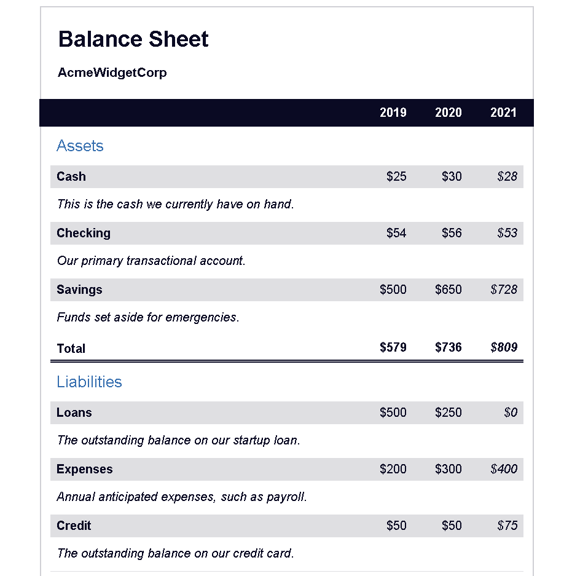

# FreeCodeCamp Balance Sheet

## Balance sheet made on FreeCodeCamp to learn more about Pseudo-Elements

In this course I better understood these concepts:

- Tags to create a table:
    - `table`: creates a table;
    - `thead`: indicates the table’s header;
    - `tbody`: indicates the table’s body;
    - `tr`: table row;
    - `td`: data cell. This element only exists to ensure you table has x-columns and it will be associated to the correct columns;
    - `th`: header cell;
- `white-space` property it’s used to determine how the white space inside an element is handled;
- `:first-of-type` pseudo-element is used to select the first element that matches the selector, and `:last-of-type` which does the exact opposite;
- `calc( )` can be used to calculate a value based on other value;
- `element[class=”classname”]` will target any **element** that has a class attributed to it. The difference between `element[class=”classname”]` and `element.classname` is that one is going to select *elements* where the *only* class is *classname* and the other one will select *elements* where it *includes* *classname*;
- `!important` ensures you that the property will not be overwritten;

# Preview

# Conclusion

The concepts I learned in this course are important because tables are a fundamental part of presenting information, and using these **elements** I learned is essential for creating a easy-to-read page. And **pseudo-elements** of course, because it can make your life so much easier when writing CSS.

My current goal is to master React, but first I need to complete some begginer courses on FreeCodeCamp.
